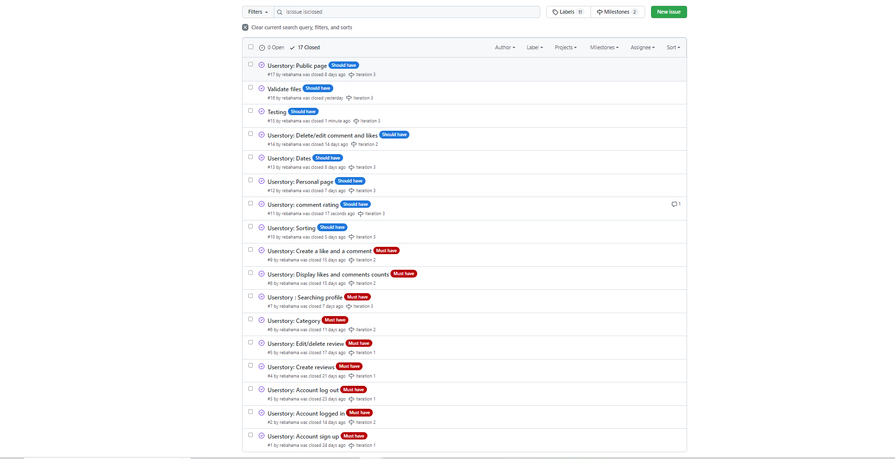
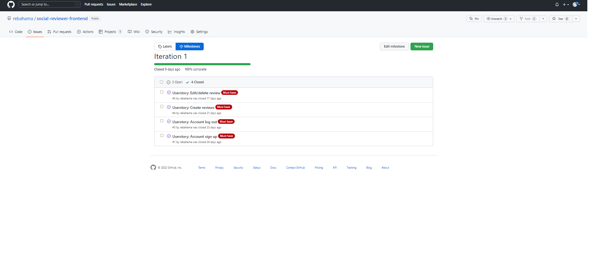
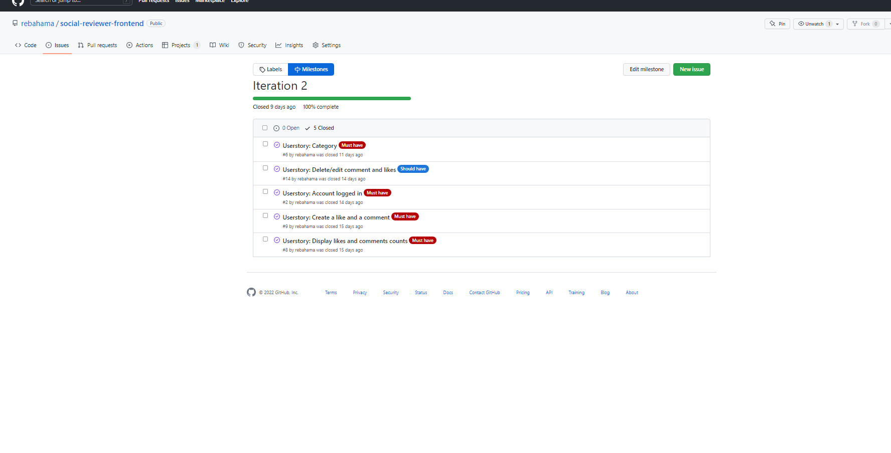
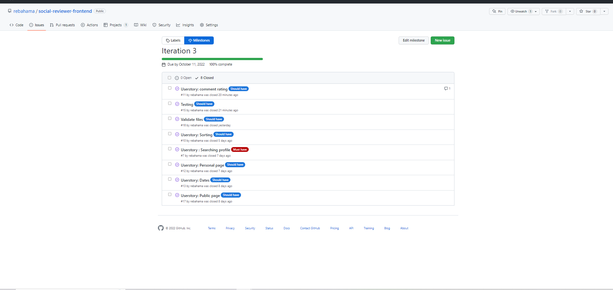

# Agile
# Overview
The total count for my userstories was 17, I had a total count of 9 must have userstories and the should have count was 8. The iteration sprints was a count of 3. I prioritized the functionality based on the requirements to pass the projects. The most important functionalites was CRUD operations so my must have was based on the CRUD. The should have was not as important and if I did not manged to finish some of the userstories around "should haves" that would not impact the project as much as the must haves.

Each iteration sprint lasted around 8 days and 3 sprints equaled around 24 days.

# Userstories

## Must have
* As a user I would like to be able to create a like and comment on diffrent reviews.

* As a user I would like to see how many likes and comments a review has so I know how popular that review is.

* As a user I would like to be able to search after a profile based on a name or username profile.

* As a user I would like to be able to choose a category for my reviews so that I can on the review what category the reviews belong to.

* As a user I would like to be able to edit/delete a review so that I can have the freedom to edit/delete the review.

* As a user I would like to be able to create a review on the website.

* As a user I would like to be able to log out from the account whenever I want to.

* As a user I would like to know if I am logged in so I don't have to log in every time.

* As a user I would like to be able to sign up and create my own account on the website.

## Should have

* As a user I would like to be able to sort the reviews after, comments, likes, prices and rating,

* As a user I would like to be able to rate review in the comment filed from 1 to 5 where 5= highest score.

* As a logged in user, I would like to be able to access and list my personal created reviews, so I know which reviews are mine.

* As a user I would like to be able to se how long a comment and a review was created so i know how relevant the review is.

* As a user I would like to be able to delete/edit my comments, and delete my likes if I changed my mind.

* As a user I would like to view a public page where all the reviews are displayed on one page so I can see everything on one page.

All the userstories

## Testing and validate

* Test the site and look for bugs.

* Validation of files.

# Iterations

## Sprint 1
In the first sprint I included almost just must haves userstories, I wanted to have room to make errors if something was not going according to plan. The plan was to first includ mostly CRUD operation userstories with the must have tag. This sprint lasted around 8 days

## Sprint 2
The second sprint had still must haves userstories as the majority, it included only one userstory with the should have. As mentioned before if the userstories for must haves was first completed in that case the controll for error would be better. This sprint lasted around 9 days 

## Sprint 3
This sprint included mostly should haves and only one must haves. The must haves originally was included in sprint 2, but due to sprint 2 ending the userstory was moved to sprint 3. I also included testing and code validation because in my last project I did not includ thoose two. One userstory: " As a user I would like to be able to rate review in the comment filed from 1 to 5 where 5= highest score." was not implemented beacuse of the time, but as mentioned before the should haves was not prioritized and therfore there was room for not completing should have userstories behind.

# Conclusion
I think that I did good on all the sprints, and I was done with the userstories on time. In sprint number 1 I got of to a good start and I hade some bugs in sprint 2 that I saved for sprint 3 beacuse the goal was to finish the must haves at all costs before the time on the sprint was due.

Only one userstory was left out beacuse of time but that userstory won´t effect the application, instead it is saved for a future feature.

