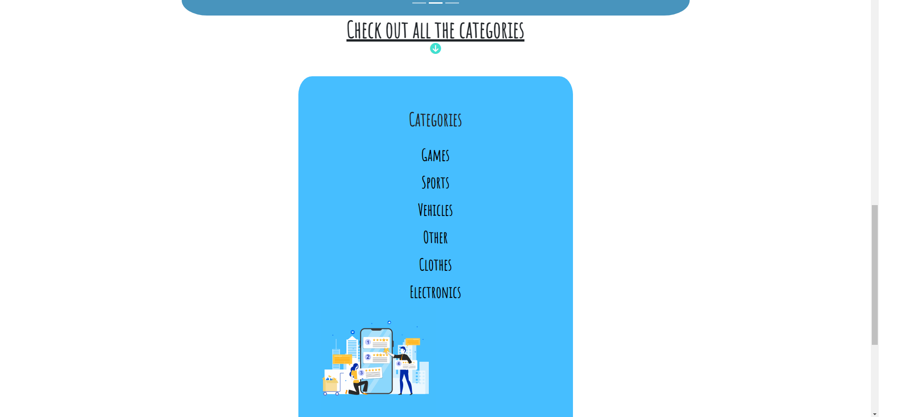
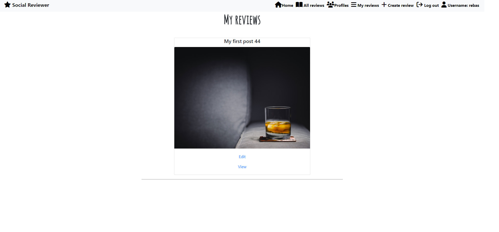

# Social reviewer

According to our research many review site lacks the social media feeling, also another problem is that on many review sites only focus on a specific subject category.
Social reviewer makes reviewing more fun and interacts the user with the reviewer in a fun way and the important part is that in the category you can choose to review everything from electronics to cars. Users can create account, create reviews, comment, upvote, see the most popular and most commented reviews. Users can also see all the profiles that are listed on the site. The target group here is anyone that would like all the reviews from diffrent categories to be on the same webpage in a fun way.

# Project goals
The project goals for this project is the following.

* Learn how to connect your frontend project to the backend.

* Learn how to reuse components throughout the page.

* CRUD functionality with React.

* Write clean code.

* Debugging with React.

* Use of network request with the async function.

# Website link

* [Social reviewer website](https://social-reviewer-frontend.herokuapp.com)

# User stories
* As a user I would like to view a public page where all the reviews are displayed on one page so I can see everything on one page.

* As a user I would like to be able to delete/edit my comments, and delete my likes if I changed my mind.

* As a user I would like to be able to se how long a comment and a review was created so i know how relevant the review is.

* As a logged in user, I would like to be able to access and list my personal created reviews, so I know which reveiws are mine.

* As a user I would like to be able to create a like and comment on diffrent reviews

* As a user I would like to see how many likes and comments a review has so I Know how popular that review is.

* As a user I would like to be able to search after a profile based on a name or username profile.

* As a user I would like to be able to choose a category for my reviews so that I can on the review what category the reviews belong to.

* As a user I would like to be able to edit/delete a review so that I can have the freedom to edit/delete the review

* As a user I would like to be able to log out from the account whenever I want to

* As a user I would like to know if I am logged in so I don't have to log in every time.

* As a user I would like to be able to sign up and create my own account on the website.

# Wireframes

## Homepage
The Homepage will welcome the user with a short text and below the text there will be a carousel with arrows. This carousel will contain, "Most liked reviews", "Most commented reviews" and also it will display a list with categories where the user will be able to click the category list. On the last page in the category there will also be a link that takes the user to show all the reviews that is on tha page. On the top the logo and navbar will always be visable to the user.

## All reviews
This page will display all the reviews that have been created on the website. Inside the cards a image and some text that the user have been asked to input will be displayed. If the user is owner of the post then two symbols one for edit and one for delete will be displayed and clickable. A search bar will also be avalible where the user can search username and title and category to find a review.

## My reviews
 This page will display only the reviews that the user have created, this page will only be available when the user is logged in.

## Profiles
This page will display all the profiles that is created on the webpage, the logged in user will also be displayed with a edit button where the user can change "name" and "bio" content. The created review count will also be displayed here and show how many reviews the user have created.

## Create review
This page will only show up if the user is logged in. Here the user will be asked to input some information and upload a image, then the user can click submit and the review will be displayed on the diffrent review pages.

## Edit review
This page is identical to the "create review" page. Here the user will be able to edit the info that is alredy inputed.

## Edit Profile
Here the user will be able to edit the profile details such as name,bio and upload a image for the user avatar.

## Are you sure ? page
This will show up every time a user makes a delete, exampale when deleting a review.

# Database diagrams

The database is used together with framework Django, the software is called: PostgresSql and it is a relational database. The is 6 diffrent models and all wil be displayed below:

## Category

## Comments

## Likes

## Post

## Profile grades

## Profile

# Features and functionality

## Navbar
The navbar displays diffrent links depending on if the user is logged in or not.

## Logged in user

## Not logged in user

## Homepage
User will be welcomed with a short intro text that will encoruage the user to see all the reviews. There is a dynamic navbar that changes based on if the user is logged in or out. Below the intro text there is a carousel with arrow that displays:

## Categories
In the first page of the carousel, there is a option of categories to choose from, depending on what the user clicks on the user will be redirected to the reviews that is relevant to the category that is clicked on.

## Most Liked
The second page in the carousel displays a list of diffrent reviews that is sorted from the most liked review to the lowest, the review with the most likes will be displayed at the top of the list.

## Most commented
The third page in the carousel will display a list with diffent reviews that is sorted with the most commented reviews starting from the top down to the lowest. All the small cards can be clicked and will take the user to the relevant review that is clicked on.

## Checkout reviews
This is the fourth and last item in the carousel, here an animation will be displayed and on the bottom there is a link that takes the user to a page where all the reviews on the webpage will be displayed.

## Footer
Bottom of the page a simple footer with links to social media will be displayed.

# All reviews

## The reveiw
Here a review is displayed that have been created on the site, on the side there is a button for edit and one for delete that only displays when the user is the owner of the post and is logged in. On the bottom of the reveiw there is a symbol for like and one for how many comments the review has. The title is clickable and will take you to the deatiled review page.

## Detailed review
This is the same as "the review" page, but the diffrence is that now you can comment on the post and see all the comments that have been made for this review.

## Comments

On the detailed reivew page, you can comment a review. When you have commented the review will be updated and display the comment. If you are the owner of the comment there will be a button displayed that makes it possible to delete the comment. There is a window for "rating" that is a future function that is not fully functional yet. But the default rating have been set to "3" until that feature is complete. This won´t affect anything apart from it being displayed.

## Delete reivew
When the user clicks on the trashcan that is displayed on the review card, a modal will be displayed that asks the user if they are sure that they want to delete the review. If the user clicks "delete" the review will be deleted and not exist on the webpage anymore. If "cancel" is clicked then the modal will be closed down.

## Edit review
When the user clicks on the "pen" symbol the user will be redirected to a edit page where the user can change the prepopulated fileds. When the user have changed the informaton a message will be displayed notifying the user that the info have been changed.

## Search
The user can use the search box in the "all reivews" page to serach for, categories,usernames and titles. Here the title have been inputed to the search box and the review is showing up.

## Sort by price
This button here will sort all the reviews from the highest price to the lowest price.

# Profiles
This page will display all the profiles that have been created on the webpage.
The user can see a bio and name on the profiles that have been created on the site. The user also can see how many reviews a profile have created and how many likes a profile have received, the profile like is a future functionality that have not been created yet. If the logged in owner scrolls down to the profile that us current logged in, the owner will be able to edit the profile leading to the "edit profile page"

## Edit profile
This page the user that is owner of the profile can change the "name" "biography" and upload an image.

# My reviews
This page only show the reviews that the current logged in user have created. The cards will also display a "edit" and a "view" link that takes the user to the deatiled review page.

# Create reivew
This page is where the user will be able to create a review. If the user lefts some filed that is required blank then a warining page will be displayed. After the user have filled in the fileds a message will be displayed saying that the review have been created.

## Create review message

# Account

## Sign in

This is the sign in page, if the fields are empty a message will be displayed saying that it needs to be inputed by the user.

## Sign up
This page the user will be able to create an account, a warning field will be displayed if the user creates a username that exist or password not matching.

# Reuse of components
After working with a real project I can now understand why components are effectiv and time saveing in React. I can take an example from my code. If we look at this file here: [Navbarcomponent](https://github.com/rebahama/social-reviewer-frontend/blob/main/src/components/NavBar.js). This file contains alot of code and it is a navbar for a webpage. If I want to display this navbar maybe in another page inside my app I don´t need to write that whole js file again. 

The only thing that I need to do is import and call that component in this format "< NavBar/>" , that line of code will call the whole file that is inside the link and it will display it on that new page. I noticed that when you are working in React and if your writing the same code throughout the page several times, then it´s best to make that code to a component so that you can use that particular code with just one line of code. The code will look cleaner and it´s good for performance.

# Future ideas
 
 * A comment rating system where the user can vote in the comment on how good the review is from 1 to 5. The model and backend for this alredy is completed, the only step is to show it on the frontend.

 * A like system for the profiles, the models and backend for this is alredy created, only the frontend needs to be implemented.

* Add infinite scroll to all the page.

* Add register with email and log in with email.
 

# Technology

* The structure of the webpage was created with HTML5.

* The styling was created with CSS3.

* React Bootstrap version 4.6.0 was used for the styling of this project.

* React version 18.2.0 was used for this project.

* React-router-dom version 5.3.0 is used as navigation and clicking links in the navbar.

* Axios version 0.27.2 is installed to fetch the api endpoints.

* jwt-decode was installed for for decoding the jason web tokens.

# API backend endpoint
The documentation for the backend can be found here [social-reviewer-backend](https://github.com/rebahama/social-reviewer-backend#readme)

# Supported screens

* Ipad Air/Ipad Mini.

* Iphone 4/6/7/XR/12 and 12 pro.

* Samsung Galaxy S8/S20.

* Nesthub Max.

# Testing 
testing can be found here.

# Deployment

* When creating the app use the command: npx create-react-app . --template git+https://github.com/Code-Institute-Org/cra-template-moments.git --use-npm

This will install all the libraries that is required for the project with the right versions.

* To install the Heroku prebuild to render onepage application type: "npm install -g serve"

* In Heroku hompage click on "create app".

* After you have created the app then click on "deploy".

* Click on github as deployment method and connect your github account to your Heroku account.

* Click on deploy branch and your app should start be live after a few minutes.

# Agile development
Agile can be found here.

# Source code
1. Go to this [repository](https://github.com/rebahama/social-reviewer-frontend)

2. Click on the green button texted "Gitpod"

3. Type npm start to get the server up and running.

# Credits

* The symbols on the webpage can be found on Fontawesome [Fontawesome](https://fontawesome.com/).

* Inspiration was taken from Code institute walkthorugh video of "Moments" [Moments](https://learn.codeinstitute.net/courses/course-v1:CodeInstitute+RA101+2021_T3/courseware/70a8c55db0504bbdb5bcc3bfcf580080/953cd4e5015f483bb05263db3e740e19/).

* The offical React documentation was used to make good coding practices  [React](https://reactjs.org/docs/getting-started.html).

* The animation from in the webpage was taken from [Lottiefiles](https://lottiefiles.com/).

* The pictures from the page was taken from [Pixabay](https://pixabay.com/sv/).

* Some help and reference was taken from the W3 school site [w3](https://www.w3schools.com/react/default.asp)
 