# Manual testing

## Testing stories

# User stories

* As a user I would like to view a public page where all the reviews are displayed on one page so I can see everything on one page.

This page is called the " show reviews" page and here all the reviews that are created is sent to that page. Testing for that have been completed. And all the reviews are displayed on that page.

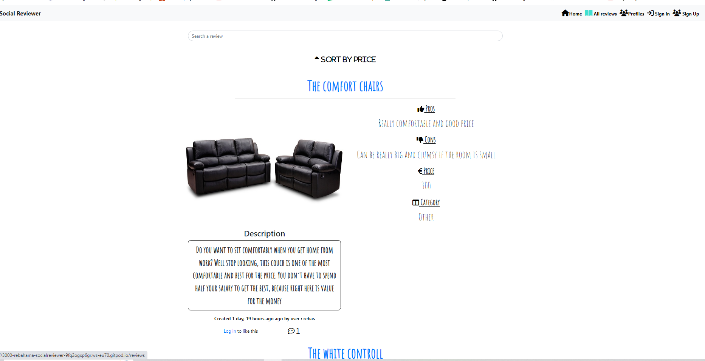

* As a user I would like to be able to delete my comments, and delete my likes if I changed my mind.
Comments can be deleted with a button, and likes will display a thumbs down button if the user have alredy liked the reveiw. If the user have not liked the review yet a thumbs upp will be displayed. Like counter goes down when user clicks on the thumbs down.

Delete comments
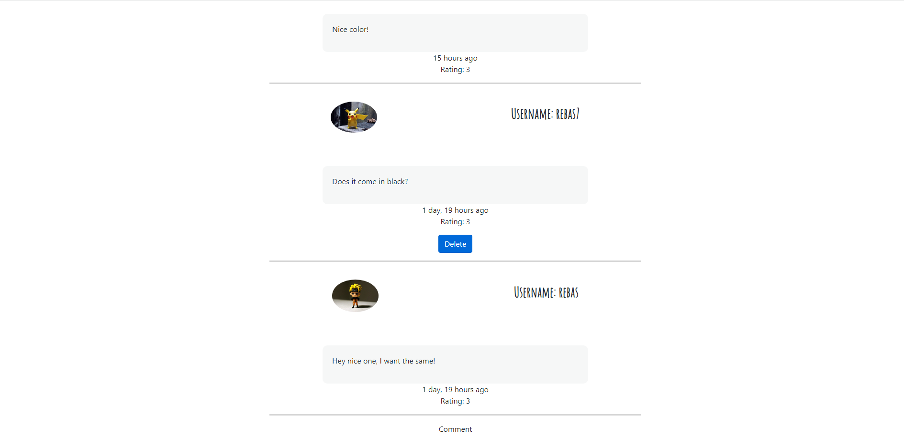

Unlike review

* As a user I would like to be able to se how long a comment and a review was created so i know how relevant the review is.

Comments and reviews display a date and time when the content was created.

Comments created date.
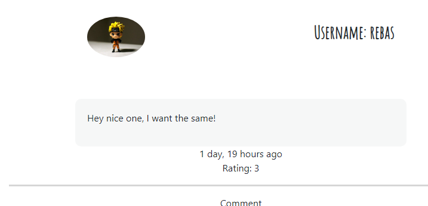

Review created date.

* As a logged in user, I would like to be able to access and list my personal created reviews, so I know which reveiws are mine.

When the user is logged in the user will be able to click on "My reveiws" and on that page only the content that the owner have created will be displayed.

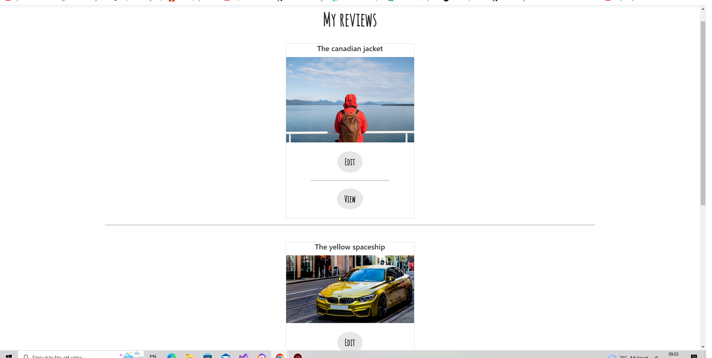

* As a user I would like to be able to create a like and comment on diffrent reviews

Users can leave a comment on a review and the comment will be displayed on the same review page. The rating fields is a future function, the backend is completed but due to time I decided to create the functionality later. Testing have been done and it won´t affect anything if the fields are there.

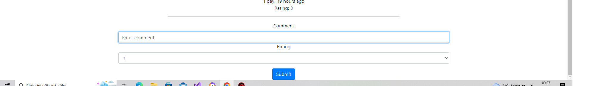

. If a user have alredy liked a review then a thumbs down will be displayed instead of a thumbs up, makeing it possible to unlike the reveiw instead.

Like it

Unliked it

* As a user I would like to see how many likes and comments a review has so I Know how popular that review is.

All the reveiws displays a like and comment counter showing how many likes or comments is in a reveiw. Testing have been down by adding comments and likes to see if the counter goes up or down.
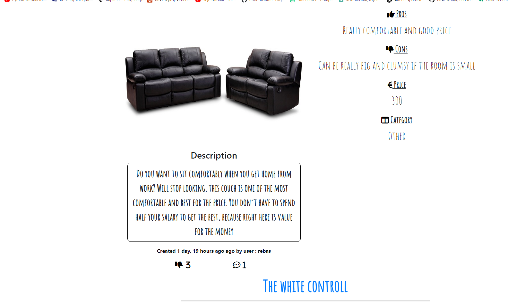

* As a user I would like to be able to search after a profile based on a name or username profile.

The search functions works as expected, and extra functionality has been added so you can search after title,username and category. Testing have been done by typing in the field and only the title,username and category relevant to the serach word are dislaying on the page.

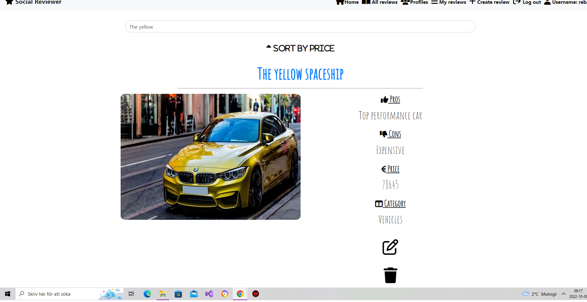

* As a user I would like to be able to choose a category for my reviews so that I can see on the review what category the reviews belong to.

Six diffrent categories can be choosen from the create review page, and after choosing category user can. Search after review with the category name. and based on what category the user choose the reveiw will be displayed on a page where all the relvant category names will be displayed.
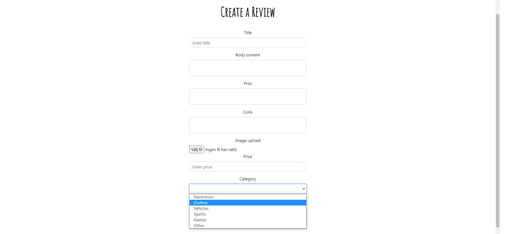

Testing have been done to make sure that when the users chooses a category on the create review page then that specific category will be displayed on the category page when the users chooses to display it in the menu below.
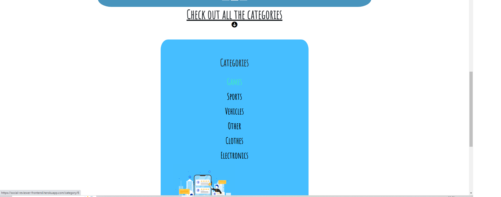

* As a user I would like to be able to edit/delete a review so that I can have the freedom to edit/delete the review.

Users can edit/delete a review but only if the user is the owner of the content that have been created. Testing have been done to delete the review and review is no longer on the page, and to edit content to see the updated information.
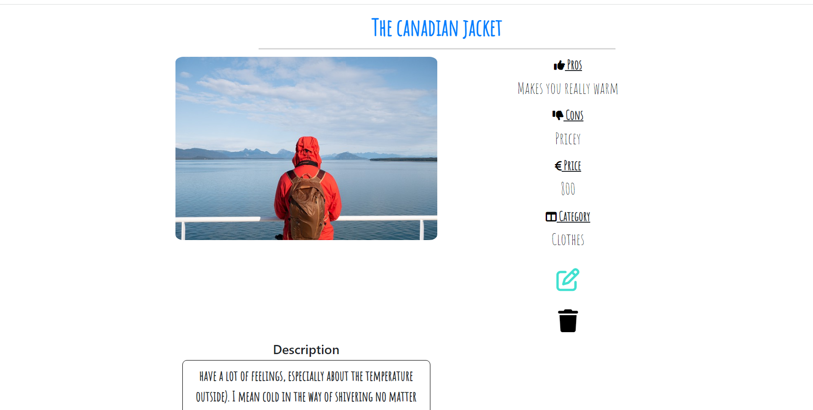

* As a user I would like to be able to log out from the account whenever I want to.

When users clicks logout then the restricted content will no longer be avalible. The navbar menu is always available. Testing have been done to see if the navbar is not available on any page.

* As a user I would like to know if I am logged in so I don't have to log in every time.

When user logged in then message will be displayed to greet the users by the username. Testing have been done and the username only shows up if the users i logged in.

On homepage.
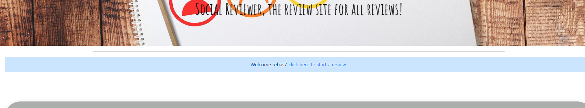

On Navbar.

* As a user I would like to be able to sign up and create my own account on the website.

Users can create an account and a link will appear when the account have been created. Testing have been by trying to log in to the page and also checking in the admin page that the profile shows up.

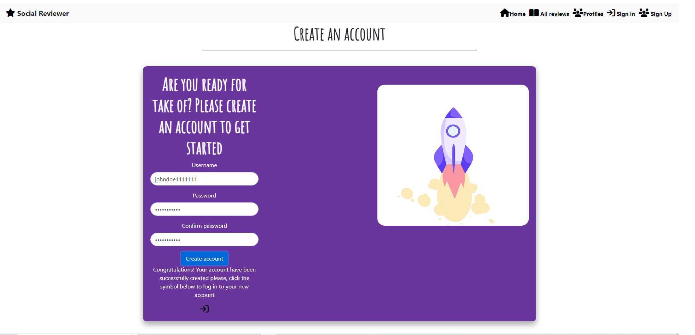

# Website testing

## Links and buttons
* All the links leads to relevant page, testing have been done by clicking on every symbol and text links and also buttons.

# Error page
* When trying to visit links that are not included in the page then following page will be displayed.

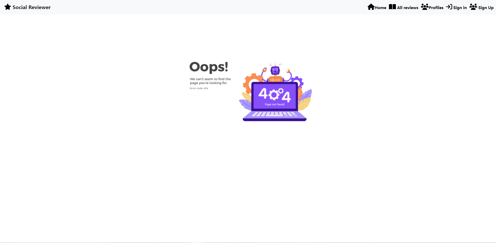

# Empty required fields

* When trying to submit empty fields that are required then messages like the one in the picture will be displayed. All the fields have been tested by submitting empty fields and no empty fields were sumbitted unless users  types in relevant data.

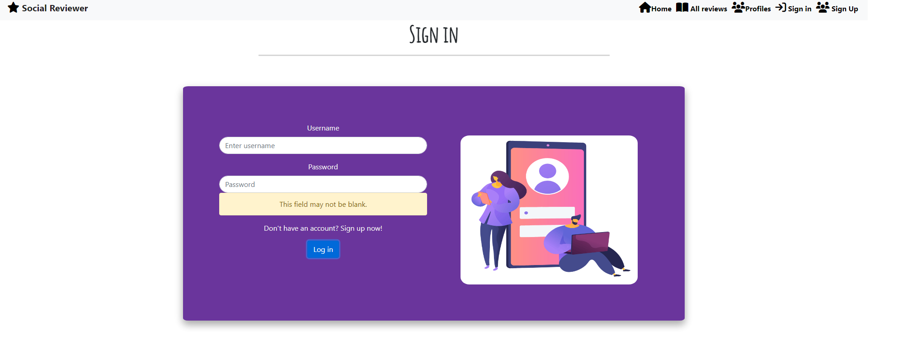

# Account and authorisation

* If a user is not logged in then it wont be possible to comment or like a review, instead a message will be displayed telling the user to sign in.

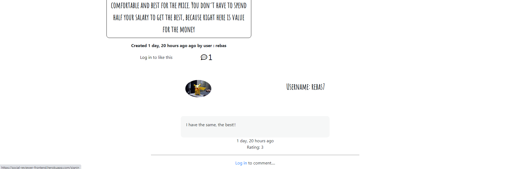

* A user can only like a review once and dubplicate is not possible.

* A user can not edit or delete a reveiw if the user is not the owner of the reveiw. Testing have been done and the symbols for editing and deleting only appear on the reviews if the logged in user is the owner of the review.

* Testing have been done to copy the url and id number of another review and try to acessing it, but if the user is not the owner then user will be redirected away makeing it not possible to edit or delete another review.

# Searching
* Searching after title,catgory and username displays reviews relevant to the search word.

# Sorting
* In the review page sorting have been tested, and the reviews that have the highest price is displayed on the top of the page.

# Popular reviews

## Top 3 Likes
* The most liked reviews have been tested by liking a review and then navigate to the homepage to see if all the top liked reviews shows up. And as expected only the top 3 most liked reviews shows up.
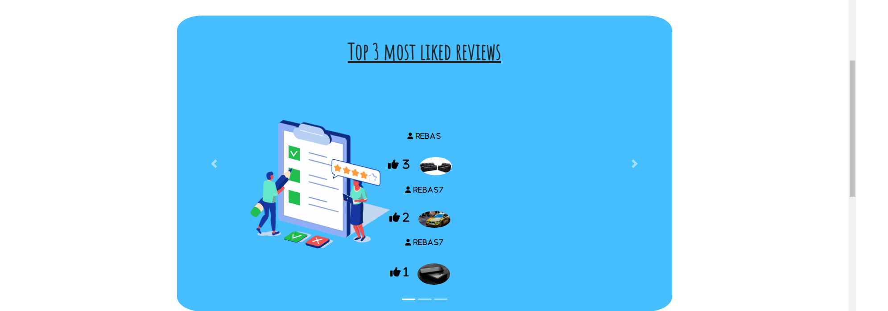

## Most commented
* The same test have been carried out for the comments and only 3 reviews with most comments are displayed.
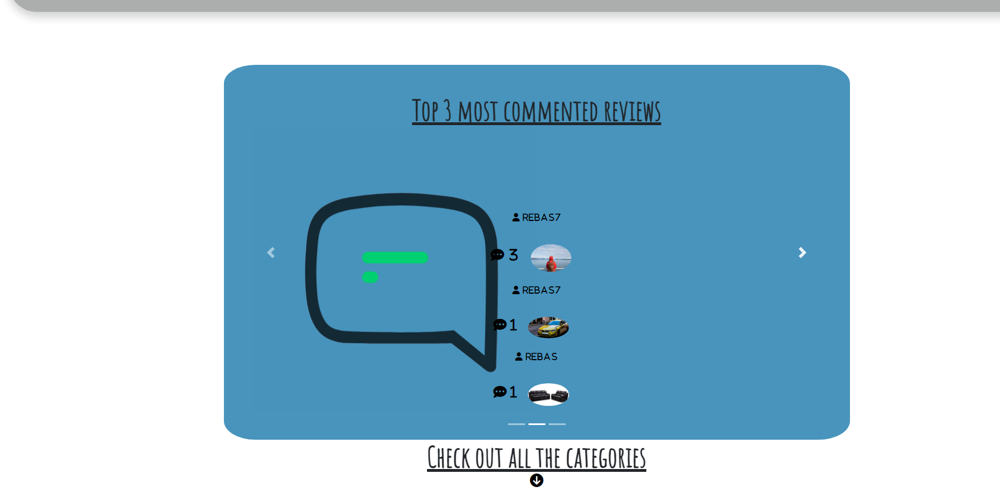

# Bugs

## Solved bugs
* When I tried to make the user to be able to log out, I ran into some issues where the user would not be logged out when trying to click on "log out". It turned out that I did not match  the url path in the frontend for the API endpoint in the backend. I had forgotten to remove a trailing slash in the front end code and after removing the trailing slash I was able to log the user out when clicking log out.

* When I tried to implement the like feature I could only like the page but not unlike. The console in the browser showed "undefined" id. It turned out that the like_id did not exist in the API endpoint. I had to review the backend code and add the like_id as a methodfield serializer and after that the like function was working and it was possbile to also unlike and the counter would go down.

* In the create review page when choosing categories the API endpoint would display: error:"500 internal error" when trying to sumbit a created review. It turned out that one of the fields where the user can choose a category was empty and the API endpoint would only work if the data was prefilled.

# Validation of files

* All the Javascript files have been validated by [JShint](http://jshint.com/).
My errors was, forgotten semicolons on several files. After adding semicolons all the errors was gone.

* CSS3 files have been validated by the offical [Jigsaw](https://jigsaw.w3.org/css-validator/)

* HTML5 was validated by the offical [W3](https://validator.w3.org/)

[Back to readme](https://github.com/rebahama/social-reviewer-frontend/blob/main/README.md)
